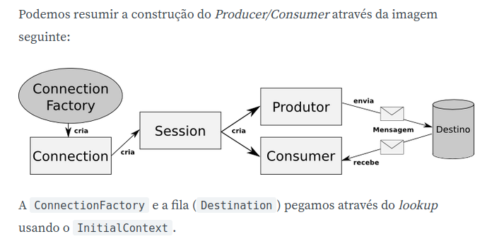

# JMS

### Docs
Java Doc
  - [Destination](http://docs.oracle.com/javaee/5/api/javax/jms/Destination.html)
  - [MessageConsumer](https://docs.oracle.com/javaee/7/api/javax/jms/MessageConsumer.html#receive-long-)
  - [MessageProducer](https://docs.oracle.com/javaee/7/api/javax/jms/MessageProducer.html)
  - [Message](https://docs.oracle.com/javaee/7/api/javax/jms/Message.html)
  - [QueueBrowser](https://docs.oracle.com/javaee/7/api/javax/jms/QueueBrowser.html)
    - [Enumeration](https://docs.oracle.com/javase/7/docs/api/java/util/Enumeration.html?is-external=true)
  - JMS spec diferences 1.0 x 2.0
    - API JMS 1.0
      - ConnectionFactory -> Connection  -> Session -> MessageConsumer
    - API JMS 2.0
      - ConnectionFactory -> JMSContext -> JMSConsumer
  - [Blog Caelum - API JMS 2.0](https://blog.caelum.com.br/a-nova-api-do-jms-2-0-no-java-ee-7/)
  - [JMS 2.0 official spec](https://javaee.github.io/jms-spec/)
    - [JMSContext](https://docs.oracle.com/javaee/7/api/javax/jms/JMSContext.html)
    - [JMSProducer](https://docs.oracle.com/javaee/7/api/javax/jms/JMSProducer.html)
    - [JMSConsumer](https://docs.oracle.com/javaee/7/api/javax/jms/JMSConsumer.html)

ActiveMQ 5
  - [JNDI Support: config initial context](https://activemq.apache.org/jndi-support.html)

JMS Conponents

### How to Run
This code intends to provide a simple study case of a JMS Consumer.

1. Download and run ActiveMQ
2. Create a queue named `fila.financeiro`
3. Enqueue a message
4. Import a project in your IDE
5. Add `ActiveMQ` jar, downloaded as a external lib in the project *(this is very simple we don't use maven or gradle yet)*.
6. **Run TestConsumer** class
7. *Debug* and *Test* as you wish.